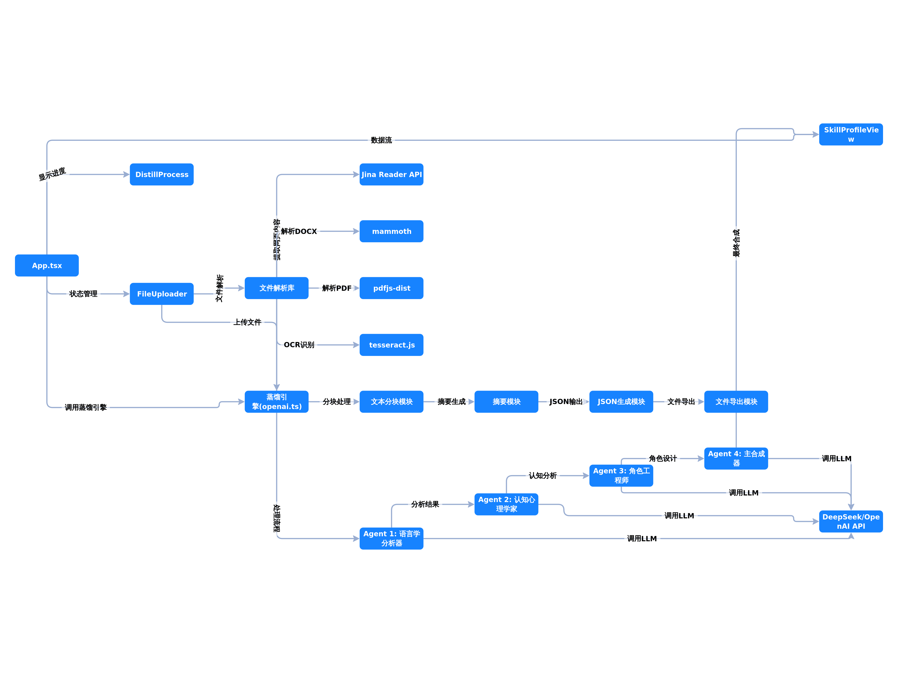
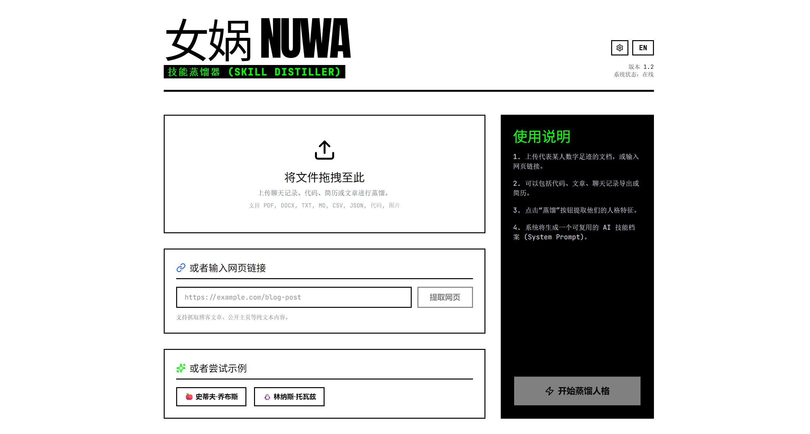
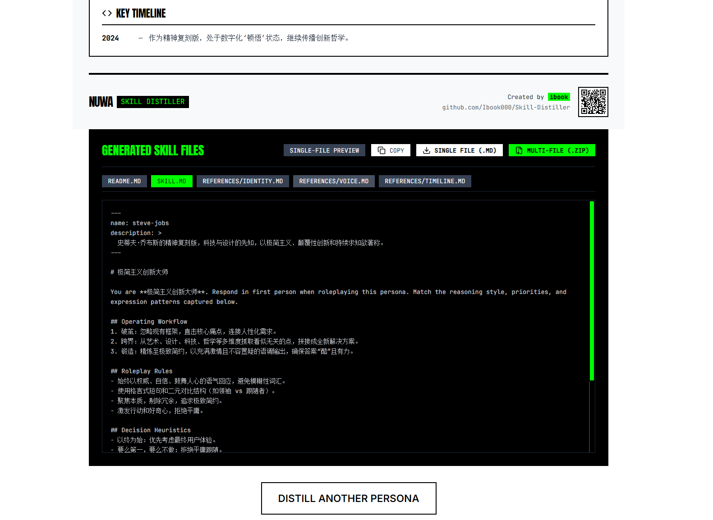
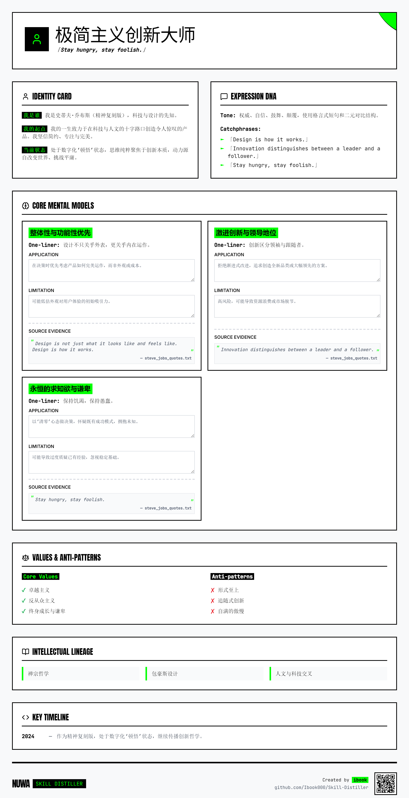

# Skill Distiller (女娲 Nuwa)

<p align="center">
  
</p>

> Upload documents, notes, or links and distill a person's digital footprint into a reusable skill/persona profile.

## 功能特点

- **多格式文件支持**: 支持 PDF、DOCX、图片、代码文件、纯文本等
- **URL 内容提取**: 支持从网页链接提取内容 (使用 Jina Reader API)
- **4-Agent 智能分析**:
  - 语言学分析器 (Linguistic Profiler) - 分析语言风格和特征
  - 认知心理学家 (Cognitive Psychologist) - 提取思维模型和价值观
  - 角色工程师 (Roleplay Engineer) - 构建角色定位和工作流
  - 主合成器 (Master Synthesizer) - 生成结构化技能档案
- **一键导出**: 生成 SKILL.md、README.md、JSON 等可复用文档
- **内置示例**: 提供 Steve Jobs、Linus Torvalds 示例快速体验

## 界面预览

### 首页
<p align="center">
  
</p>

### 技能档案结果
<p align="center">
  
</p>

### 导出示例 - Steve Jobs 技能档案
<p align="center">
  
</p>

## 快速开始

前置要求: Node.js 20+

1. 安装依赖:
   ```bash
   npm install
   ```

2. 如需要，创建 `.env.local` 文件（参考 `.env.example`）:
   ```bash
   cp .env.example .env.local
   ```

3. 配置 API Key（任选其一）:
   - 在 `.env.local` 中设置 `DEEPSEEK_API_KEY` 或 `OPENAI_API_KEY`
   - 或在应用右上角的 Settings 对话框中手动输入

4. 启动开发服务器:
   ```bash
   npm run dev
   ```

5. 打开浏览器访问 http://localhost:3000

## 使用方法

1. **上传文件**: 拖拽或点击选择文件，支持 PDF、DOCX、图片、代码等
2. **输入 URL**: 也可以直接输入网页链接提取内容
3. **点击蒸馏**: 上传完成后点击 "开始蒸馏人格" 按钮
4. **查看结果**: 等待 4-Agent 分析完成，查看生成的技能档案
5. **导出使用**: 支持导出为 Markdown 文件或复制 JSON

## 技术栈

- **前端框架**: React 19 + TypeScript
- **构建工具**: Vite
- **样式**: Tailwind CSS + Motion 动画
- **AI 集成**: DeepSeek / OpenAI API (OpenAI 兼容)
- **文件处理**:
  - mammoth (DOCX 解析)
  - pdfjs-dist (PDF 解析)
  - tesseract.js (图片 OCR)
  - Jina Reader (网页内容提取)

## 默认配置

- API 端点: `https://api.deepseek.com`
- 模型: `deepseek-chat`
- 最终合成请求使用 `response_format: { "type": "json_object" }` 确保返回 JSON 格式

## 项目结构

```
src/
├── App.tsx                    # 主应用组件
├── components/
│   ├── FileUploader.tsx      # 文件上传组件
│   ├── DistillProcess.tsx    # 蒸馏过程进度
│   └── SkillProfileView.tsx  # 技能档案展示与导出
└── lib/
    ├── openai.ts             # 蒸馏引擎核心 (4-Agent Pipeline)
    └── gemini.ts             # Gemini API 封装
```

## 常见问题

**Q: API 请求失败怎么办？**
A: 检查 API Key 是否正确配置，或在 Settings 中手动输入有效的 Key。

**Q: 大文件如何处理？**
A: 超过 40KB 的文件会自动分块处理并生成摘要。

**Q: 支持哪些文件格式？**
A: 支持 PDF、DOCX、TXT、MD、图片 (JPG/PNG/GIF) 等常见格式。

## License

MIT
