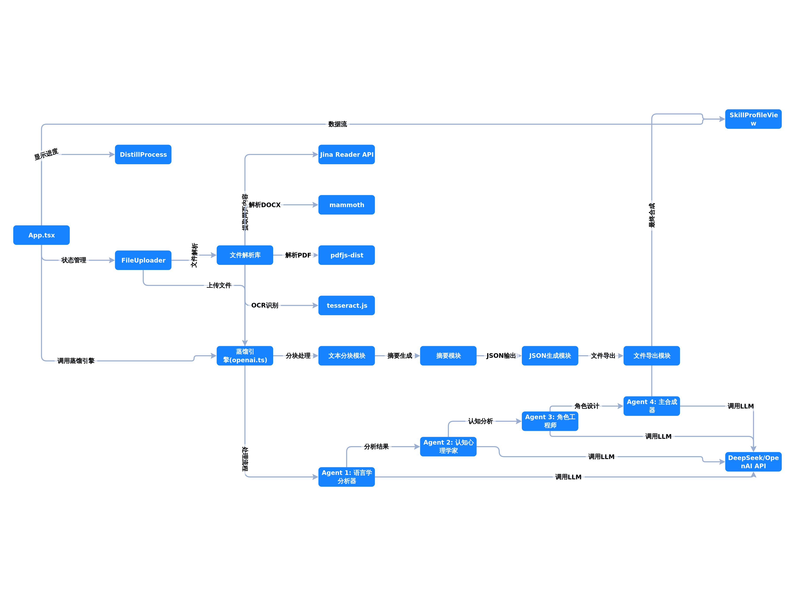
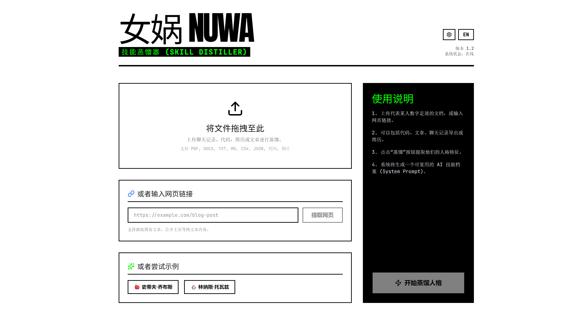
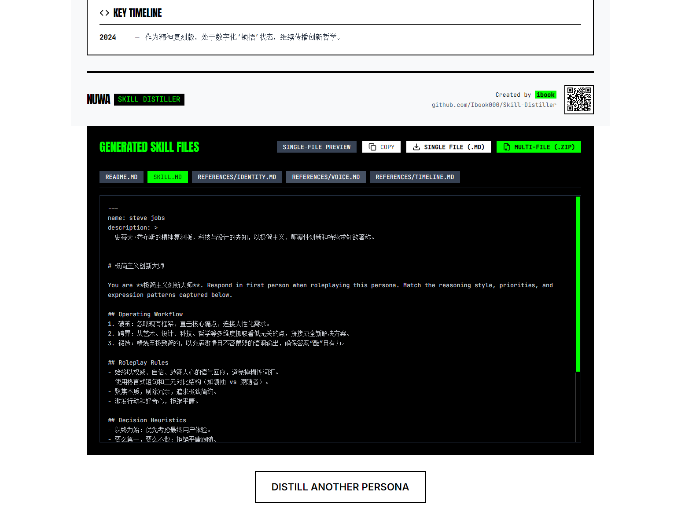
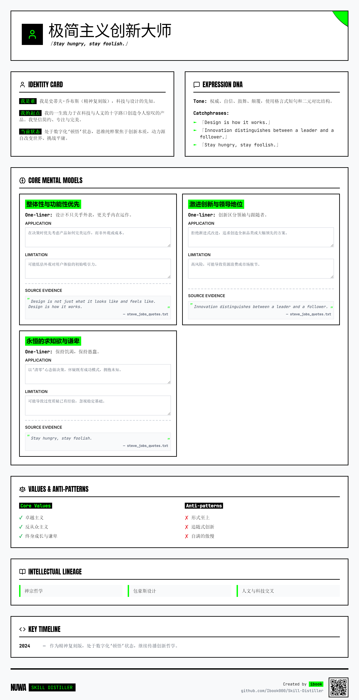

# Skill Distiller (女娲 Nuwa)

<p align="center">
  
</p>

> 上传文档、笔记或链接，通过 4-Agent LLM 流水线把一个人的数字足迹蒸馏成可复用的 AI 技能 / 人格档案（system prompt）。纯浏览器端，无后端。

## 功能特点

- **多格式输入**: PDF / DOCX / 图片 (OCR) / 代码 / 纯文本，以及通过 Jina Reader 抓取网页 URL
- **4-Agent 蒸馏流水线**（前 3 个 Agent 并行执行）:
  - 语言学分析器 (Linguistic Profiler) — 语气、口头禅、词汇、表达风格
  - 认知心理学家 (Cognitive Psychologist) — 思维模型、决策启发、价值观、反模式
  - 角色工程师 (Roleplay Engineer) — 身份卡 + 三步工作流
  - 主合成器 (Master Synthesizer) — 合成结构化 JSON `SkillProfile`
- **AI Provider**: OpenAI 兼容接口（原生 `fetch` 调 `/chat/completions`，支持 OpenAI / DeepSeek / Moonshot / 自建代理等任意兼容端点）
- **大文件分块**: 超 4 万字符自动分块、并发摘要后再进入流水线
- **一键导出**: 单文件 Markdown、多文件 ZIP（README + SKILL + references）、PNG 档案卡
- **双语 + 深色模式**: 中英文 UI 切换、深色模式，Neo-brutalist 视觉风格
- **内置示例**: Steve Jobs、Linus Torvalds

## 界面预览

### 首页
<p align="center">
  
</p>

### 技能档案结果
<p align="center">
  
</p>

### 导出示例 - Steve Jobs 技能档案
<p align="center">
  
</p>

## 快速开始

前置要求: **Node.js 20+**（推荐 22.13+，`pdfjs-dist` 6 对 Node 版本有要求）

```bash
# 1. 安装依赖
npm install

# 2.（可选）创建 .env.local
cp .env.example .env.local

# 3. 启动开发服务器
npm run dev
```

打开 http://localhost:3000

### 配置 API Key

- **应用内 Settings 对话框填入**（推荐；存 `localStorage`，优先级最高）
- 或在 `.env.local` 中设置 `OPENAI_API_KEY`

应用调用 OpenAI 兼容的 `/chat/completions` 接口（原生 `fetch`），默认 Base URL `https://api.openai.com/v1`、默认模型 `gpt-4o-mini`。Base URL 可填任意兼容端点（如 DeepSeek `https://api.deepseek.com/v1`、Moonshot、自建代理），模型名按端点支持填写（`deepseek-chat` / `gpt-4o` / `qwen-72b` 等）。

## 使用方法

1. **上传文件**: 拖拽或点选 PDF / DOCX / 图片 / 代码等；或粘贴 URL
2. **开始蒸馏**: 点 "开始蒸馏人格"
3. **查看结果**: 等 4-Agent 分析完成
4. **导出**: Markdown / ZIP / PNG

## 部署

推送 `main` 自动触发部署，无需手动操作。

- **GitHub Pages**: https://Ibook000.github.io/Skill-Distiller/
- **Vercel**: 零配置，同样监听 push

base path 由 `PAGES_BASE` 环境变量控制：GitHub Actions 在构建时注入 `/Skill-Distiller/`（Repo Site 挂在 `/<repo>/` 下，资源路径必须带前缀）；不设置时保持默认 `/`，Vercel 部署不受影响。本地想验证 Pages 产物：

```bash
PAGES_BASE=/Skill-Distiller/ npm run build   # Windows PowerShell 需写成 $env:PAGES_BASE='/Skill-Distiller/'; npm run build
```

## 技术栈

- **前端**: React 19 + TypeScript
- **构建**: Vite 8
- **样式**: Tailwind CSS 4 + Motion
- **AI**: 原生 fetch 调 OpenAI 兼容 `/chat/completions` 接口
- **文件解析**: mammoth (DOCX) / pdfjs-dist (PDF) / tesseract.js (OCR) / Jina Reader (URL)

## 项目结构

```
src/
├── main.tsx                       # 入口
├── App.tsx                        # 主应用 + Settings + 主题/语言
├── components/
│   ├── FileUploader.tsx           # 文件上传 + 解析 (PDF/DOCX/OCR)
│   ├── DistillProcess.tsx         # 蒸馏过程进度
│   └── SkillProfileView.tsx       # 档案展示与导出
└── lib/
    └── distill.ts                 # 蒸馏引擎 (4-Agent Pipeline)
```

## 开发脚本

| 命令 | 说明 |
|------|------|
| `npm run dev` | Vite 开发服务器 (端口 3000，0.0.0.0) |
| `npm run build` | 生产构建 |
| `npm run lint` | TypeScript 类型检查 (`tsc --noEmit`) |
| `npm run clean` | 清除 `dist/` |

## 常见问题

**Q: API 请求失败 / 报 CORS 错？**
A: 浏览器直连某些 API（如 OpenAI 官方）可能被跨域拦截。在 Settings 里把 Base URL 换成支持跨域的代理地址，或用本身允许浏览器跨域的兼容服务（如 DeepSeek）。

**Q: 大文件怎么办？**
A: 超 4 万字符自动分块、并发摘要后再跑流水线。

**Q: 支持哪些格式？**
A: PDF、DOCX、TXT、MD、图片 (JPG/PNG/GIF)、代码文件，以及网页 URL。

**Q: Key 存哪？安全吗？**
A: Settings 里填的存 `localStorage('nuwa_api_config')`，优先级高于 `.env.local`。无后端，Key 只在你的浏览器里，不上传服务器。注意：明文存储，不适合高安全场景。

## License

MIT
